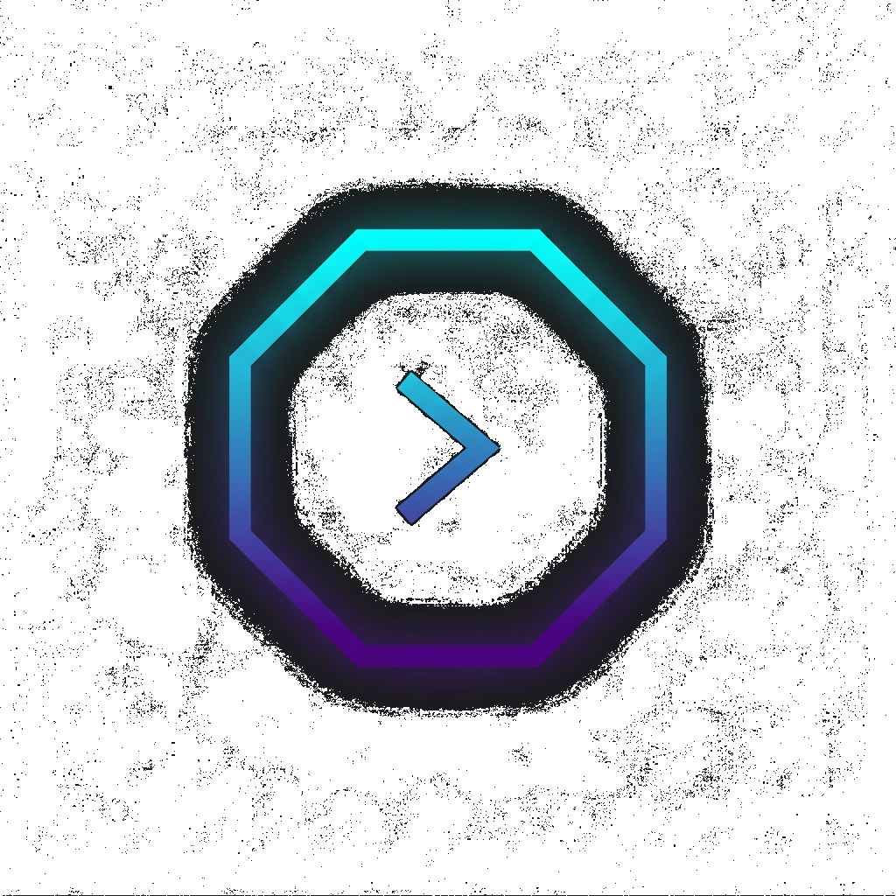

<div align="center">
  
  <h1>Desktop App Template</h1>
  <p><b>Base para aplicaciones de escritorio nativas con backend FastAPI y frontend React</b></p>

  [](version.txt)
  []()
  []()
  []()
</div>

---

## 📌 ¿Qué es este proyecto?

**Desktop App Template** es una base reutilizable para construir aplicaciones de
escritorio: una ventana nativa (Edge WebView2 en Windows, WebKit en macOS/Linux)
que carga una interfaz React, respaldada por un backend local FastAPI. No incluye
ninguna funcionalidad de negocio: es el punto de partida sobre el que construir tu
propia aplicación.

---

## ✨ Qué trae la base

- 🪟 **Ventana nativa + WebView embebido:** `app/desktop_app.py` levanta el backend en
  un hilo daemon, espera a que esté listo y abre una ventana nativa apuntando a él.
- ⚡ **Backend FastAPI local:** sirve el frontend compilado, expone la API REST y
  un WebSocket autenticado para eventos en tiempo real (`src/backend/server_app.py`).
- 🔒 **Autenticación local:** todas las rutas `/api/*` (salvo el bootstrap) exigen
  un token secreto generado una única vez por instalación, para que ninguna otra
  aplicación en la misma máquina pueda leer la API local (`agent/settings.py`).
- 🧷 **Bandeja del sistema:** cerrar la ventana la oculta a la bandeja en lugar de
  matar el proceso; un ícono permite reabrirla o salir del todo.
- 🎛️ **Branding configurable por entorno:** nombre, título de ventana y tooltip de
  bandeja se leen de variables de entorno (`agent/env_config.py`), sin tocar código.
- 🎨 **Frontend React + Vite + Tailwind:** con tema claro/oscuro persistente,
  manejo de errores (`ErrorBoundary`) y componentes de UI reutilizables
  (`ActionMenu`, `ConfirmDialog`).
- 📦 **Empaquetado multiplataforma:** recetas de PyInstaller e Inno Setup listas
  para generar un ejecutable en Windows, macOS y Linux.

---

## 💻 Requisitos del Sistema

### 👤 Para Ejecución del Binario Compilado
* **Windows:** 10 (21H2+) u 11, con **Microsoft Edge WebView2 Runtime**
  *(preinstalado por defecto)*.
* **macOS / Linux:** WebKit nativo del sistema (WebKit2GTK en Linux).

### 🧑‍💻 Para Desarrollo y Compilación desde Código Fuente
* **Python:** 3.10 o superior.
* **Node.js:** v18.0.0 o superior (`npm`).
* **Inno Setup 6:** *(opcional, solo para generar el instalador de Windows)*.

---

## 🚀 Entorno de Desarrollo

### 1. Preparar el Entorno

```powershell
# Crear e instalar entorno virtual de Python
python -m venv .venv
.\.venv\Scripts\Activate.ps1
pip install -r requirements.txt -r requirements-dev.txt

# Instalar dependencias del Frontend
cd src/frontend
npm install
cd ../..
```

### 2. Ejecutar en Desarrollo (Live Reload)

- **Frontend React/Vite:** `cd src/frontend && npm run dev`
- **Aplicación Desktop:** `python app/desktop_app.py`
*(o usa la tarea integrada de VSCode: `🚀 Levantar Todo en Desarrollo`)*.

### 3. Rebrandear la aplicación

Copia `.env.example` a `.env` y define `APP_NAME`, `APP_TITLE` y `TRAY_TOOLTIP`
para renombrar la app sin tocar código.

### 4. Subir la versión del proyecto

Usa la tarea de VSCode `🔖 Subir Versión (major/minor/patch)` (o ejecuta
`.\scripts\bump_version.ps1 -Part patch|minor|major`) para incrementar
`version.txt` siguiendo SemVer y mantener sincronizado el badge de este README.

---

## 📦 Compilación (*Build Pipeline*)

- **Windows:** `.\scripts\build.ps1` — compila el frontend, empaqueta con
  PyInstaller y genera el instalador con Inno Setup en `dist/`.
- **Linux:** `./scripts/build_linux.sh`
- **macOS:** `./scripts/build_macos.sh`

---

## 📂 Estructura del Proyecto

```
desktop-app-template/
├── 📁 app/                        # Entry point de la aplicación de escritorio
│   ├── desktop_app.py             # Lanzador Desktop (FastAPI + WebView nativo)
│   └── preflight_check.py         # Verificación previa de entorno (Windows)
│
├── 📁 assets/                     # Iconos de la aplicación (icon.png, icon.ico, icon.icns)
├── 📁 packaging/                  # Recetas PyInstaller (.spec) e Inno Setup (.iss)
├── 📁 scripts/                    # Scripts de compilación (build.ps1, build_linux.sh, build_macos.sh, bump_version.ps1)
│
├── 📁 src/                        # Código Fuente Principal
│   ├── 📁 backend/                # Servidor FastAPI, WebSocket y API REST base
│   └── 📁 frontend/               # Interfaz de usuario React + Vite + Tailwind CSS
│
├── 📁 agent/                      # Configuración y estado local persistente
│   ├── env_config.py              # Variables de entorno (puerto, branding, modo dev)
│   └── settings.py                # Token de autenticación local
│
├── 📄 version.txt                 # Archivo de versión actual
└── 📄 README.md                   # Documentación principal del proyecto
```
